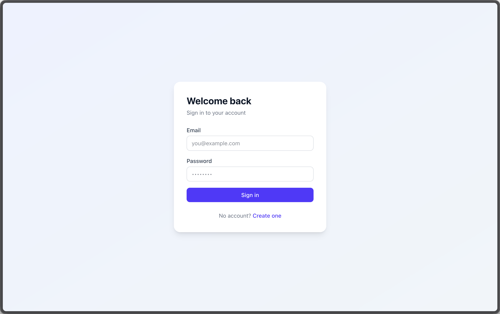
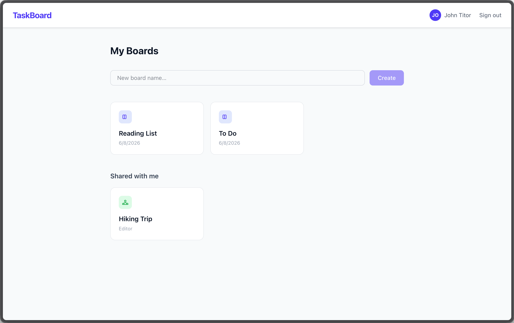
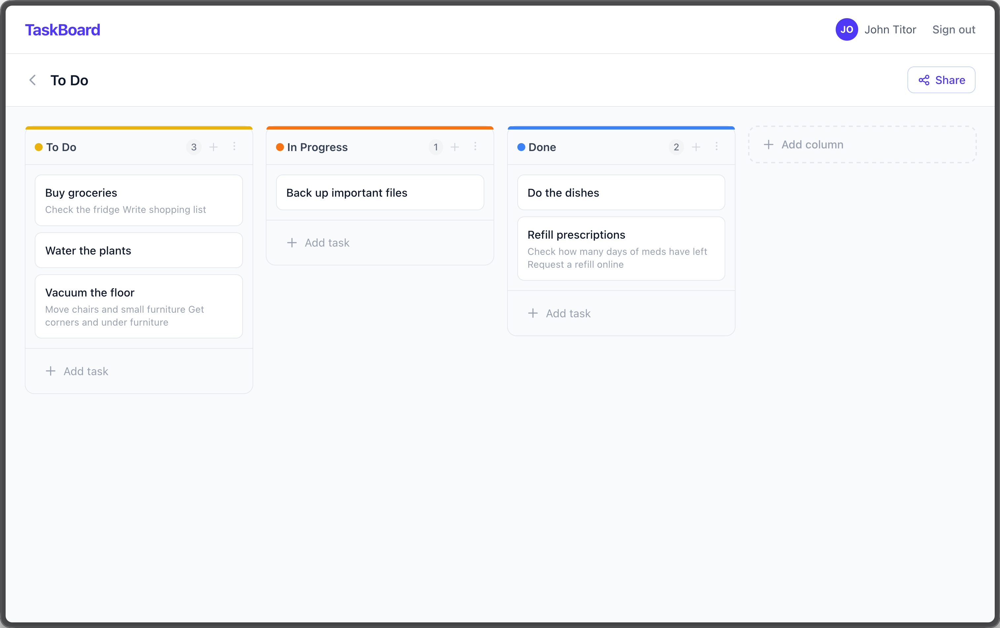

# TaskBoard

[](https://vercel.com/new/clone?repository-url=https://github.com/SyrymAbdikhan/task-board)

A task manager built with Vue 3 and Supabase. Create boards, drag tasks between columns, and collaborate with teammates via shareable invite links.

## Features

- **Auth** — email/password sign-up and sign-in, protected routes redirect unauthenticated users
- **Boards** — create and delete personal boards, each scoped to the logged-in user via RLS
- **Columns** — add, rename, recolor, and delete columns per board
- **Tasks** — create, edit, and delete tasks, drag to reorder or move between columns
- **Drag & drop** — smooth task reordering via vue-draggable-plus
- **Share link** — generate a read-only public link, anyone can view without signing in
- **Invite link** — generate an editor invite link, anyone who signs in with it is added as a collaborator
- **Members** — board owner can see and remove editors, editors can leave the board
- **Profile** — edit display name and email address

## Screenshots

**Login**


**Dashboard**


**Board View**


## Tech Stack

- [Vue 3](https://vuejs.org/) (Composition API)
- [Pinia](https://pinia.vuejs.org/) — state management
- [Vue Router 5](https://router.vuejs.org/) — protected routes
- [Supabase](https://supabase.com/) — auth, Postgres, row-level security
- [Vite 8](https://vitejs.dev/) — build tool
- [Tailwind CSS v4](https://tailwindcss.com/) — styling
- [vue-draggable-plus](https://alfred-skyblue.github.io/vue-draggable-plus/) — drag and drop

## Local Setup

### 1. Create a Supabase project

1. Go to [supabase.com](https://supabase.com) and create a new project
2. In **SQL Editor**, run the contents of [`supabase/schema.sql`](supabase/schema.sql)
3. Copy your **Project URL** and **anon public key** from **Settings -> API**

### 2. Configure environment

```bash
cp .env.example .env
```

Edit `.env`:

```env
VITE_SUPABASE_URL=https://your-project-id.supabase.co
VITE_SUPABASE_ANON_KEY=your-anon-key-here
```

### 3. Install & run

```bash
npm install
npm run dev
```

Open [http://localhost:5173](http://localhost:5173)

## Demo

A live demo is available at [task-board.shetel.dev](https://task-board.shetel.dev/)

Email and password: `securesharona@sharebot.net`

## Deploy to Vercel

1. [Fork this repo](https://github.com/SyrymAbdikhan/task-board/fork)
2. Import it on [vercel.com/new](https://vercel.com/new)
3. Add environment variables in the Vercel dashboard:
   - `VITE_SUPABASE_URL`
   - `VITE_SUPABASE_ANON_KEY`
4. Deploy — `vercel.json` SPA rewrite is already included
5. Then in your Supabase project go to **Authentication → URL Configuration** and set:
   - **Site URL** — your production domain `https://your-project-name.vercel.app`
   - **Redirect URLs** — your production domain with wildcard `https://your-project-name.vercel.app/**`

## Project Structure

```
src/
├── assets/         # Global CSS (Tailwind entry)
├── components/     # Shared UI components
├── router/         # Vue Router with auth guards
├── stores/
│   ├── auth.js     # Sign in/up/out, profile management
│   └── boards.js   # Boards, columns, tasks, sharing, members
├── utils/
│   └── supabase.js # Supabase client
└── views/          # Route-level page components
```
